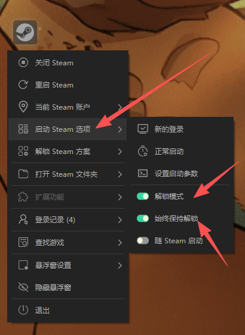
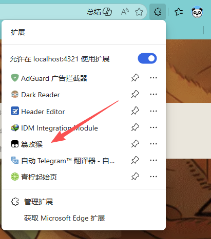
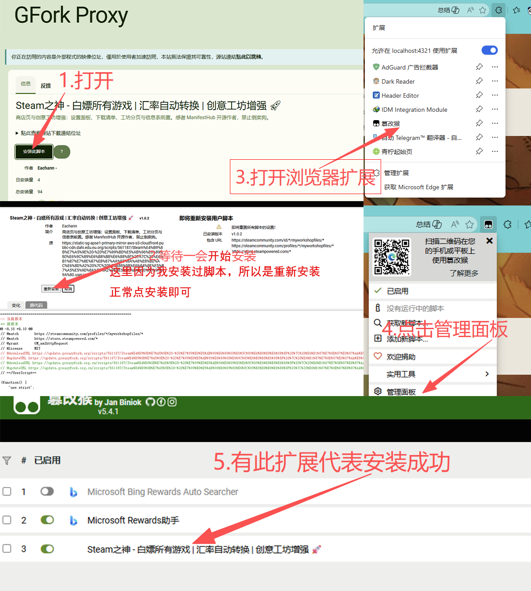
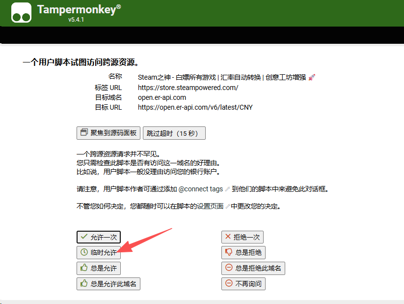
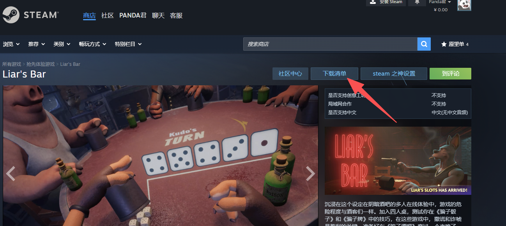
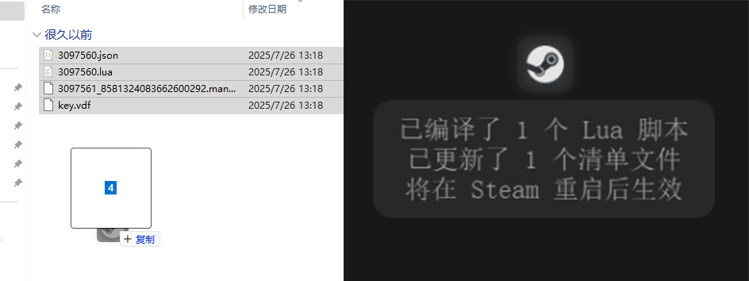
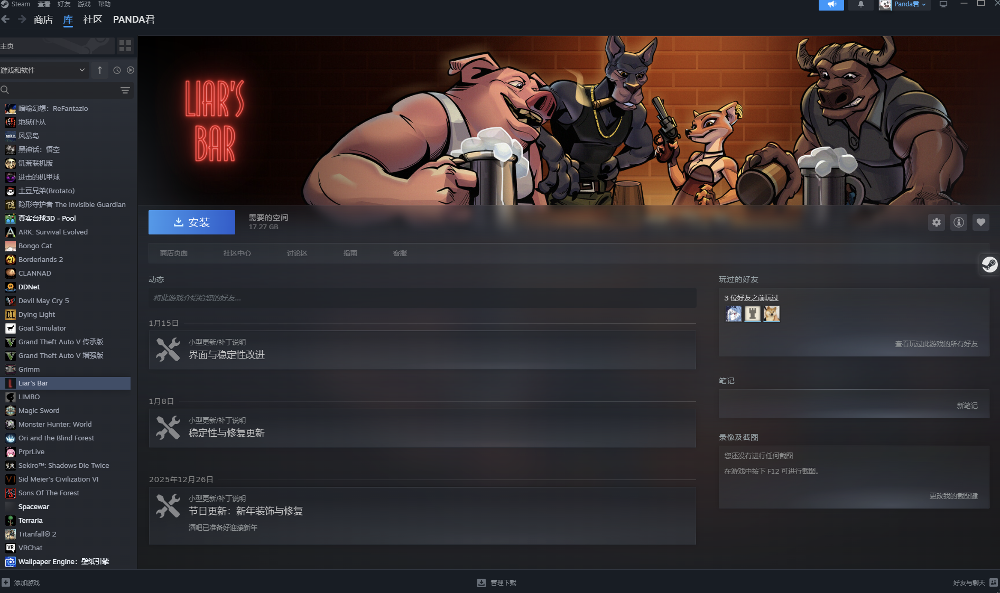

:::caution[警告]
 **还是一句话，用就别怕，怕就别用。**  
 **可以各大平台搜下假入库风险后抉择。**
:::
:::note[前言]
**此工具可以使未购买的游戏成功入库，达到(` 自欺欺人 `)的效果**     
**建议多支持一下正版捏~**
:::

----

## 准备工作

* 会看教程的大脑
* 已安装Steam
* 部分需要**科学上网**
* 浏览器需正常访问Steam

## 1.安装SteamTools

打开[SteamTools](https://www.steamtools.net/)，在主页有立即获取的按钮，进入后下载安装版即可。


根据提示安装，完成后打开会在屏幕出现一个悬浮球，这个就是工具本体：

这时候我们右键这个悬浮窗，“启动Steam 选项”调整“ 中将 **"解锁模式"** 和另一个 **"始终保持解锁"** 选项打开，这样就保持假入库解锁状态，调整完毕后**通过工具来重启Steam**。


## 2.下载游戏清单（必做）

装上了Steamtools，但不能直接下载游戏，需要获取这个游戏的`游戏清单`才能假入库以及下载游戏。

### 2.1 安装浏览器Tampermonkey（篡改猴）插件和脚本

这里用`Microsoft Edge`来举例，国内下载速度快比较方便。  
点击链接安装[Tampermonkey-(篡改猴)](https://microsoftedge.microsoft.com/addons/detail/%E7%AF%A1%E6%94%B9%E7%8C%B4/iikmkjmpaadaobahmlepeloendndfphd)  ，安装完成后打开浏览器扩展，如图所示。

我们需要使用 `Greasy Fork` 来获取脚本，但原站点已被`(GFW)`封锁，需使用中文镜像站获取。打开[Steam之神](https://home.greasyfork.org.cn/zh-hans/info/#/zh-CN/scripts/561187/detail)获取下这个脚本，点击安装此脚本，安装完毕后按照图片检查是否安装成功。



### 2.2 进入Steam获取游戏下载清单
打开[Steam网页端](https://store.steampowered.com/)登录下，这里可能会弹“试图访问跨源资源”，`临时允许`即可，嫌烦的话可以选择`总是允许`。
登录完成后，这里我们随便入库一个游戏试试，如骗子酒馆，这边我们可以看到上面有一个`下载清单`按钮，点击会下载一个压缩包。

下载完成解压后会得到一个这样的文件夹，包含以下文件，有了这几个文件即可免Steam校验直接下载：
```
ManifestHub-3097560
├─ 3097560.json
├─ 3097560.lua
├─ 3097561_8581324083662600292.manifest
└─ key.vdf
```
## 3. 入库游戏并下载启动
鼠标拖动选择解压出来的文件，拖到SteamTools悬浮窗，等待一会即可入库成功。

再重新右键一下SteamTools重启Steam，即可正常下载游玩，效果如图

:::tip[注]
注：
入库的游戏想和朋友联机，需下载联机补丁，利用`SpaceWar`来进行联机。
:::